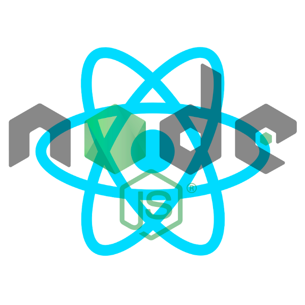

<!-- PROJECT LOGO -->
<div align="center">
  <a href="https://github.com/markdalyy/full-stack-js">
    
  </a>
  <h3>Full stack JS</h3>

  <p>
    Full stack JavaScript web app.
    <br />
    <a href="https://github.com/markdalyy/full-stack-js"><strong>Explore the project »</strong></a>
    <br />
  </p>
</div>

<!-- TABLE OF CONTENTS -->
<details>
  <summary>Table of Contents</summary>
  <ol>
    <li>
      <a href="#about-the-project">About The Project</a>
      <ul>
        <li><a href="#built-with">Built With</a></li>
      </ul>
    </li>
    <li>
      <a href="#getting-started">Getting Started</a>
      <ul>
        <li><a href="#prerequisites">Prerequisites</a></li>
        <li><a href="#installation">Installation</a></li>
      </ul>
    </li>
  </ol>
</details>

<!-- ABOUT THE PROJECT -->
## About The Project


This is a full stack JavaScript web application with React client side and Node.js/Express server side with MySQL database.

### Built With

* [React](https://reactjs.org/)
* [Node.js/Express] (https://nodejs.org/en/)
* [MySQL] (https://www.mysql.com/)
* [Sequelize ORM] (https://sequelize.org/)

<p align="right">(<a href="#top">back to top</a>)</p>

<!-- GETTING STARTED -->
## Getting Started

Instructions on how to view the entire project locally.

To get a local copy up and running follow these simple steps.

### Prerequisites

Things you need to use the software and how to install them.
* Node

   Go to [Node.js Official Website](https://nodejs.org/en/download/ "Download") and download the relevant version for your operating system.

   Tip: If on Linux system, scroll down to "Installing Node.js via package manager" and follow the instructions for your distribution.

* MySQL

    Install MySQL Server and Workbench from [MySQL Official Website](https://dev.mysql.com/downloads/)

* Sequelize

    npm install sequelize sequelize-cli
    sequelize init
    sudo npm install -g sequelize-cli (if above fails then init again)


### Installation
**To view the entire project in Godot:**
1. Clone the repo.
   ```sh
   git clone https://github.com/markdalyy/full-stack-js.git
   ```

2. Open the project in terminal.

3. Run npm start.

<p align="right">(<a href="#top">back to top</a>)</p>
